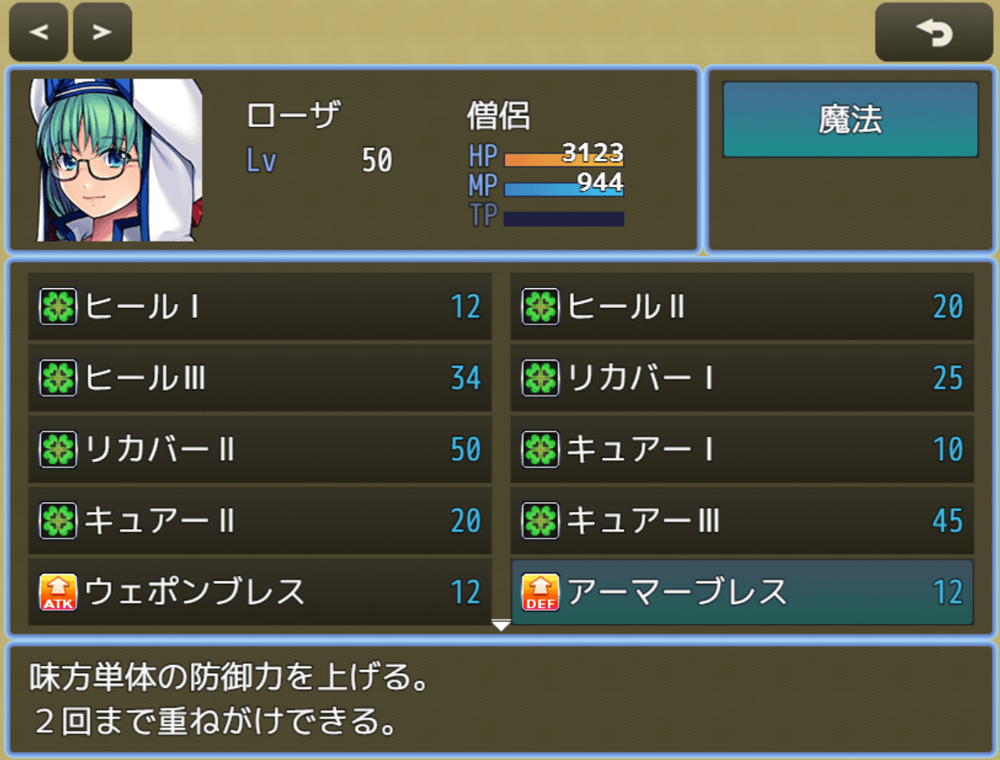
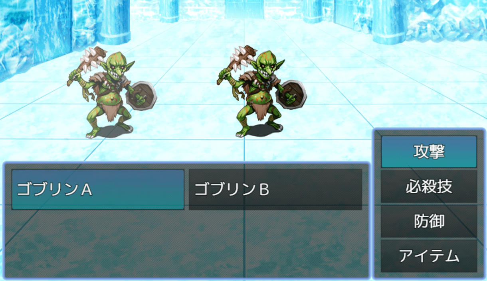

# MZ用コマンド行間設定プラグイン（NLM_CommandHeightMZ.js）
### RPGツクールMZ専用プラグイン

各コマンドやリストの行間（高さ）を広げて表示します

- タッチ・クリック操作をしやすくする目的でつくりました  
- パラメータで高さの微調整ができます

戦闘アクターコマンドで、ステータスウインドウの高さを超えて表示ができるのが特長です

# download

プラグインの download は、[右クリック「名前を付けてリンク先を保存」](https://raw.githubusercontent.com/nolimits-tukool/NLM_CommandHeightMZ/refs/heads/main/NLM_CommandHeightMZ.js)  
RPGツクールMZ専用です

# license

　MITライセンスの通りです

## [リポジトリ 一覧へ](https://github.com/nolimits-tukool?tab=repositories)
